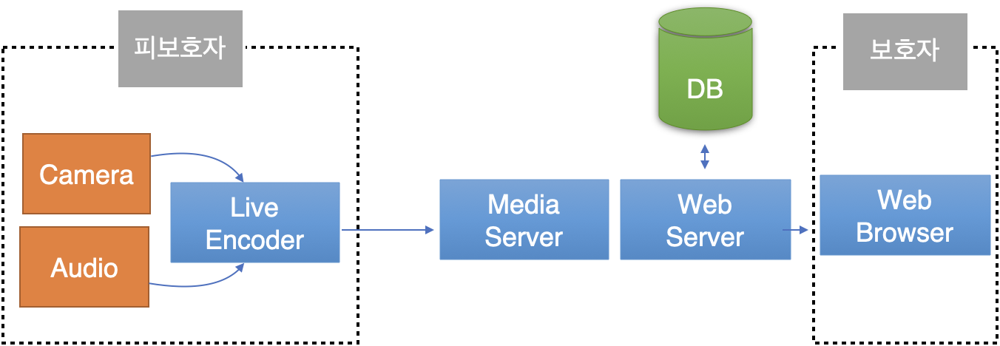
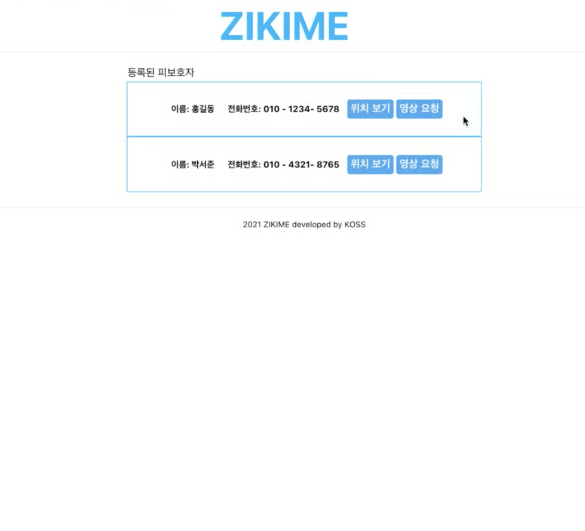
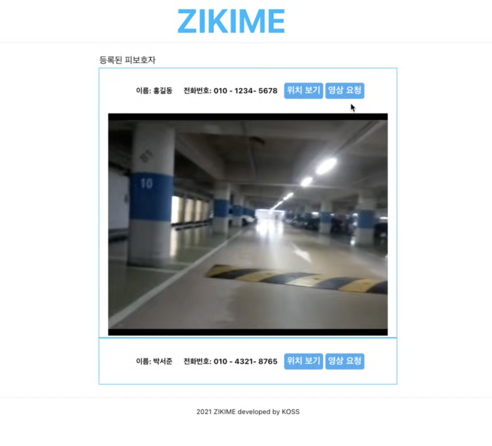

# zikime-server (지키미 웹서버)

### 1. Introduction

ZIKIME는 카메라로 피보호자의 눈이 되어 보호자에게 주변 상황을 알려준다. 주변 상황을 파악한 보호자는 위급한 상황이라고 판단할 시, 피보호자에게 받은 정보를 전송하여 SOS요청기능을 통해 신속하게 구조 요청을 할 수 있다. 또한, 신변의 위협을 느낀 피보호자가 있다면 ZIKIME가 가지고 있는 위치, 영상정보를 전송하여 직접 보호자, 구호기관에 선택적 SOS요청을 할 수 있다. 



| 웹 브라우저를 통한 등록된 피보호자 목록 확인 | 웹 브라우저를 통한 등록된 피보호자 실시간 정보 요청 및 확인 |
| -------------------------------------------- | ----------------------------------------------------------- |
|         |                        |


#### 1.1. zikime-device

[지키미 디바이스 시작하기](https://github.com/ZIKIME2021/zikime-device) 를 참고하십시오.

#### 1.2. zikime-server

[지키미 서버 시작하기](https://github.com/ZIKIME2021/zikime-server) 를 참고하십시오.


### 2. Pre-Requirement

1. Node.js 설치
2. Mongodb 설치

### 3. Start React front-end Application at Local

1. 패키지 설치

````shell
$ git clone https://github.com/ZIKIME2021/zikime-server.git
$ cd zikime-server/front
$ npm install
$ yarn install
````

2. 실행

```shell
$ npm start
```

3. 의존성

```json
"dependencies": {
    "@testing-library/jest-dom": "^5.11.4",
    "@testing-library/react": "^11.1.0",
    "@testing-library/user-event": "^12.1.10",
    "babel-eslint": "^10.1.0",
    "eslint-config-react-app": "^6.0.0",
    "history": "^5.0.1",
    "hls.js": "^1.0.9",
    "react": "^17.0.2",
    "react-dom": "^17.0.2",
    "react-router-dom": "^5.2.0",
    "react-script": "^2.0.5",
    "react-scripts": "^4.0.3",
    "styled-components": "^5.3.0",
    "web-vitals": "^1.0.1"
  },
 "devDependencies": {
    "eslint": "^7.32.0",
    "eslint-plugin-jest": "^24.4.0"
  }
```


### 4. Node.js Api Restful Service

1. 패키지 설치

```shell
$ git clone https://github.com/ZIKIME2021/zikime-server.git
$ cd zikime-server/api
$ npm install
$ yarn install
```

2. run

```shell
$ npm start
```

3. 의존성

```json
"dependencies": {
    "body-parser": "^1.19.0",
    "express": "^4.17.1",
    "immutable": "^4.0.0-rc.14",
    "lodash": "^4.17.21",
    "mongodb": "^4.1.1",
    "nodemon": "^2.0.12",
    "socket.io": "^4.1.3",
    "uWebSockets.js": "uNetworking/uWebSockets.js#v19.3.0",
    "uws": "^200.0.0"
}
```


